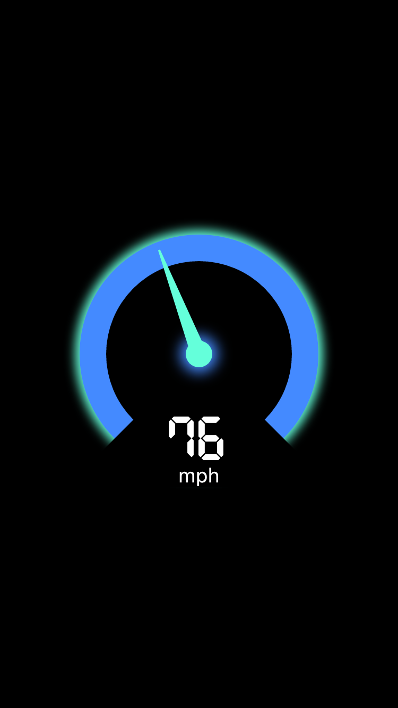

# flutter_speedometer

[Flutter](https://flutter.io) Speedometer widget package



### Getting Started

In order to use this package, do import
```dart
import 'package:flutter_speedometer/flutter_speedometer.dart';
```

Basic implementation can be done like below code:
```dart
import 'package:flutter/material.dart';
import 'package:flutter_speedometer/flutter_speedometer.dart';

void main() {
  runApp(
    Center(
      child: Speedometer(
        size: 250,
        currentValue: 76,
        minValue: 0,
        maxValue: 180,
        displayText: 'mph',
      ),
    ),
  );
}
```

### Example App
You can find more examples from [Example App](example)


### API
In this table, you can find all attributes provided by this package:

| Attribute           | Default value                     | Description |
| ------------------- | --------------------------------- | ----------- |
| currentValue        | 0                                 | Set the current value |
| minValue            | 0                                 | Min value to be displayed |
| maxValue            | 100                               | Max value to be displayed |

### Objects
```dart
class Speedometer {

  final int currentValue;
  final int minValue;
  final int maxValue;
}
 ```


### Feedback

Feel free to [leave any feedback](https://github.com/ltdangkhoa/Flutter-Speedometer/issues) for helping support this package 🍻 
